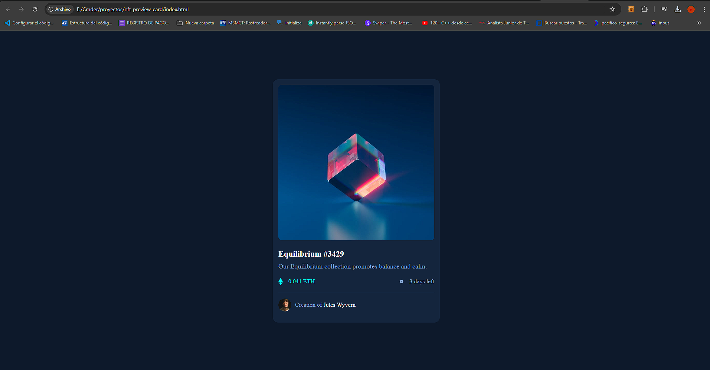

# Make It Real - NAME OF THE PROJECT

This is a solution to the nft-preview-card project of the Make It Real course.

## Table of contents

- [Overview](#overview)
  - [The challenge](#the-challenge)
  - [Screenshot](#screenshot)
- [My process](#my-process)
  - [Built with](#built-with)
  - [What I learned](#what-i-learned)
  - [Continued development](#continued-development)
  - [Useful resources](#useful-resources)
- [Author](#author)
- [Acknowledgments](#acknowledgments)

## Overview

### The challenge

Users should be able to:

- Crear una estructura de HTML
- Crear el archivo CSS

### Screenshot

## My process

### Built with

- Semantic HTML5 markup
- CSS custom properties
- Mobile-first workflow

### What I learned

Aprendi a utilizar estilos de CSS, hover, estructuras html

### Continued development

Mejorar en el desarrollo de estilos CSS y herramientas.

### Useful resources

## Author

https://github.com/francocasa/nft-preview-card/tree/main

## Acknowledgments
